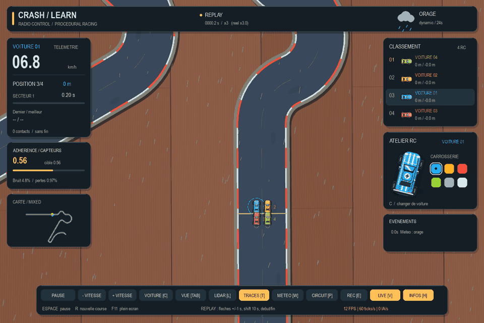

# CrashLearn2

Un simulateur de course pour observer et entraîner des IA : **1 à 4 voitures**, 23 circuits fixes ou une route procédurale infinie, météo, collisions, enregistrement et replay.



## Démarrer

Avec Python **3.12 ou supérieur**, depuis la racine du dépôt :

```powershell
python -m venv .venv
.venv/Scripts/python -m pip install -e .
.venv/Scripts/python -m crashlearn_sim
```

Sous Linux/macOS, utiliser `python3` puis `.venv/bin/python`.

Choisir un circuit, préparer les voitures dans le paddock, sélectionner leurs pilotes et démarrer. **Les modèles IA ne sont pas inclus.** Formats acceptés : `agent.py` avec ses poids, `model.onnx` accompagné de son `agent.py`, ou PPO `.zip` compatible.

Pour une distribution Windows, lancer `CrashLearn.exe` en conservant son dossier complet.

## Documentation

| Besoin | Guide |
|---|---|
| Installer et lancer une première course | [Démarrage](docs/getting-started.md) |
| Commandes, météo, enregistrement et entraînement | [Utilisation](docs/usage.md) |
| Résoudre un problème | [Dépannage](docs/troubleshooting.md) |
| Savoir où modifier le code | [Architecture](docs/architecture.md) |
| Installer les outils, tester et construire | [Développement](docs/development.md) |
| Utiliser les outils du moteur historique | [Référence historique](docs/reference/legacy-api.md) |

## Vérifier

```powershell
.venv/Scripts/python -m pip install -e ".[dev,legacy]"
.venv/Scripts/python -m pytest
.venv/Scripts/python -m ruff check .
.venv/Scripts/python -m ruff format --check .
```

Les tests graphiques sont optionnels. Le test historique T08 est un échec attendu documenté dans le [guide développeur](docs/development.md).

## Licences

[MIT](LICENSE) · [GPL v3 des circuits](src/crashlearn_sim/resources/maps/LICENSE). Les attributions d’origine sont conservées.
