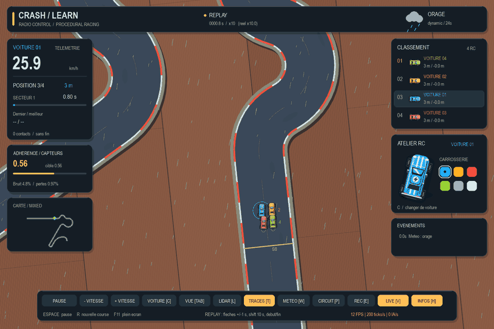

# CrashLearn2 — Courses procédurales

Un simulateur de course pour observer et entraîner des IA sur une **route qui se construit devant les voitures et disparaît derrière elles**. Quatre véhicules, une météo qui modifie l’adhérence et des tracés reproductibles à partir d’une graine.



*120 secondes de simulation en 12 secondes de GIF, en boucle. Rendu réel du simulateur, quatre agents ONNX, graine 6, météo dynamique et lecture à ×10. L’export est calculé hors ligne ; il ne mesure pas les performances en temps réel de la machine.*

[Démarrage](#démarrage) · [Commandes](#commandes) · [Météo et circuits](#météo-et-circuits) · [Entraînement](#entraînement) · [Vérification](#vérification)

## Ce que propose le simulateur

- **Route infinie à mémoire bornée** : lignes droites, courbes ouvertes, chicanes successives, épingles serrées et virages au-delà de 180°.
- **Course de 1 à 4 IA** : collisions, classement, secteurs chronométrés et redémarrage automatique quand la course est terminée.
- **Physique et capteurs** : dynamique F110, LiDAR calculé sur les rails, adhérence variable, bruit et pertes de mesure.
- **Démonstration interactive** : caméra embarquée ou vue large, fenêtre redimensionnable, plein écran, panneaux masquables et vitesse ×1 à ×10.
- **Entraînement et relecture** : environnement Gymnasium, PPO, enregistrement progressif SQLite et replay sans modèle IA.

## Démarrage

### Prérequis

- Python **3.12 recommandé**.
- Un agent compatible avec le simulateur historique, incluant ses modèles ONNX. **Les poids ne sont pas inclus dans ce dépôt.**

Par défaut, le simulateur charge l’agent du dépôt voisin :

```text
T-AIA-901/
├── CrashLearn2-procedural-simulation/
└── T-AIA-901-NCY-9-1-crashlearn-2/
    └── submission/champion/
```

Si ton agent est ailleurs, indique son dossier avec `--agent CHEMIN`. Chaque voiture dispose de sa propre instance ; aucun pilote de remplacement n’est activé silencieusement.

### Installer et lancer sous Windows

Depuis la racine du dépôt, dans PowerShell :

```powershell
python -m venv .venv
.venv/Scripts/python -m pip install -r requirements-procedural.txt
.venv/Scripts/python procedural_demo.py
```

La démo démarre avec **4 voitures, météo cyclique, profil mixte et vitesse ×3**.

Pour une course à ×10 avec météo dynamique et vue large :

```powershell
.venv/Scripts/python procedural_demo.py --seed 6 --cars 4 --weather dynamic --speed 10 --overview
```

Avec un autre agent :

```powershell
.venv/Scripts/python procedural_demo.py --agent "C:/chemin/vers/mon-agent" --speed 10
```

<details>
<summary>Installation sous Linux / macOS</summary>

```bash
python3 -m venv .venv
.venv/bin/python -m pip install -r requirements-procedural.txt
.venv/bin/python procedural_demo.py --agent /chemin/vers/mon-agent
```

Pour les commandes suivantes, remplacer `.venv/Scripts/python` par `.venv/bin/python`.

</details>

## Commandes

| Commande | Action |
|---|---|
| **F11** / **Alt+Entrée** | Plein écran ; retour à la taille de fenêtre précédente |
| **Espace** / bouton Pause | Suspendre ou reprendre |
| **+ / −**, **↑ / ↓** | Régler la vitesse de ×1 à ×10 |
| **1…9**, **0** | Choisir directement la vitesse ; `0` = ×10 |
| **Tab** | Alterner caméra embarquée et vue large de toute la route active |
| **H** / bouton Infos | Afficher ou masquer les panneaux ; le cadrage large s’adapte |
| **C** | Changer de voiture suivie |
| **L** / **T** | Afficher les mesures LiDAR / les trajectoires des IA |
| **W** | Changer de mode météo |
| **P** | Changer de profil de route et démarrer une nouvelle graine |
| **R** | Nouvelle course |
| **E** | Démarrer ou arrêter l’enregistrement |
| **V** | Lire le dernier enregistrement / revenir au direct |
| **← / →** en replay | Reculer ou avancer de 1 s ; **Shift** : 10 s |
| **Début / Fin** en replay | Première / dernière image |
| **Échap** | Quitter le plein écran, ou fermer en mode fenêtre |

La fenêtre accepte le redimensionnement et l’agrandissement natifs. `--fullscreen` démarre en plein écran ; `--window-size 1000 700` choisit uniquement la taille initiale.

Le HUD indique la vitesse demandée **et celle réellement atteinte**, qui dépend de la machine. L’accélération ne change pas le pas physique. En vue large, la limite jaune marque la génération et la limite rouge la suppression de la route.

## Météo et circuits

### Choisir la météo

| `--weather` | Comportement |
|---|---|
| `original` | Sec : adhérence 1, bruit LiDAR de ±0,1 % |
| `cycle` *(défaut)* | Sec → pluie → orage → éclaircie, toutes les 20 s simulées |
| `dynamic` | Régime aléatoire différent du précédent, toutes les 12 à 32 s simulées |
| `stress` | Adhérence cible aléatoire entre 0,55 et 1 toutes les 20 s simulées |

En mode dynamique, l’adhérence cible vaut 0,92–1 au sec, 0,70–0,87 sous la pluie et 0,55–0,65 pendant l’orage. Les transitions sont progressives. Les modes perturbés peuvent atteindre ±5 % de bruit LiDAR et 1 % de pertes de mesure.

Pluie, zones humides fixes sur la chaussée, projections et éclairs accompagnent la météo. Le hasard du rendu est indépendant de celui de la physique et des capteurs.

### Choisir le tracé

`--seed` permet de retrouver une génération. `--profile mixed` mélange les difficultés ; `flowing` favorise les portions faciles ; `technical` favorise les enchaînements serrés. Tous conservent plusieurs types de sections.

Le générateur combine dix familles : lignes droites, courbes ouvertes, angles droits, doubles coudes, chicanes, triples chicanes, esses, épingles à 180°, doubles épingles et boucles ouvertes de 195 à 250°. Les inversions de courbure peuvent s’enchaîner sans ligne droite intermédiaire.

La route mesure **4,8 m de large**. Les épingles descendent à **2,55 m de rayon**, soit environ 36 cm entre les rails des deux branches au minimum. Les candidats qui se croisent ou se rapprochent trop sont rejetés.

Le simulateur conserve 160 m devant la tête et 50 m derrière la dernière voiture active. Un tampon de 180 m supplémentaires peut être recalculé hors champ en cas d’impasse, sans déplacer les rails déjà publiés. Le retard maximal de 100 m entre voitures borne la carte en mémoire.

## Enregistrer et revoir une course

```powershell
.venv/Scripts/python procedural_demo.py --record recordings/course.sqlite
.venv/Scripts/python procedural_demo.py --replay recordings/course.sqlite
```

Le fichier contient la géométrie, les poses, la météo, les mesures et les événements. La relecture boucle et fonctionne **sans charger l’agent ONNX**. Un fichier existant n’est jamais écrasé.

L’écriture SQLite est progressive, validée tous les 100 pas et à la fermeture. La taille du fichier augmente avec la durée ; la course n’est pas accumulée en mémoire.

## Entraînement

```powershell
.venv/Scripts/python procedural_train.py --steps 200000 --cars 4 --weather cycle --output recordings/procedural_ppo
.venv/Scripts/python procedural_demo.py --ppo recordings/procedural_ppo.zip
```

L’entraînement accepte également `--agent CHEMIN` pour les adversaires. L’option `--ppo` de la démo remplace le pilote de la première voiture ; la démo charge toujours les agents du dossier ONNX.

`ProceduralEnv` expose **131 observations** normalisées : 100 mesures LiDAR, vitesse, braquage, 4 × 7 valeurs pour les adversaires et adhérence. Deux actions pilotent vitesse et braquage. La récompense valorise la progression et pénalise les contacts ainsi que, légèrement, le braquage.

L’épisode finit quand la voiture entraînée abandonne ou atteint l’arrivée optionnelle ; il est tronqué à 4 000 décisions par défaut. Les graines changent entre épisodes. PPO apprend une nouvelle politique : il ne réentraîne pas l’ONNX importé. La démo accepte aussi les anciennes politiques à 102 observations.

<details>
<summary>Physique, capteurs et règles de course</summary>

- Dynamique F1TENTH single-track, intégration RK4 à **100 Hz**, décisions à **20 Hz**, délai de braquage de **20 ms**.
- LiDAR : **100 rayons de −π à +π**, portée **15 m**, intersections avec les rails. Comme pour l’agent d’origine, les voitures sont transmises via `opponents`, pas comme obstacles LiDAR.
- Contacts : empreinte du véhicule contrôlée à 100 Hz, arrêt contre les rails, séparation et impulsion entre voitures. Un contact autorise une tentative de dégagement.
- Abandon : **4 s sans progression**, ou **plus de 100 m de retard**. La démo suit une voiture encore active et redémarre quand la course est terminée.
- Course infinie : secteurs de **100 m** à la place de tours fermés. `lap_count` compte les secteurs, `progress` mesure l’avancement dans le secteur et `distance_m` la distance totale. Les 32 derniers chronos sont conservés.
- `--finish-distance 1000` fixe une arrivée à 1 km depuis le départ de chaque voiture, dans la démo comme dans l’entraînement.

</details>

## Vérification

```powershell
.venv/Scripts/python -m unittest test_procedural -v
.venv/Scripts/python procedural_demo.py --headless --cars 4 --weather stress --steps 10000
.venv/Scripts/python capture_road_overviews.py --output recordings/overviews
```

Les tests couvrent la géométrie, la mémoire bornée, les graines, le contrat LiDAR, la météo, les collisions, les secteurs, l’environnement Gymnasium, l’enregistrement et les commandes de l’interface. Le script de captures produit les graines 0 à 5 sans sélectionner les résultats.

Pour régénérer le GIF du README avec le rendu du simulateur :

```powershell
.venv/Scripts/python -m pip install Pillow
.venv/Scripts/python tools/export_demo_gif.py
```

L’export utilise l’agent par défaut ou `--agent CHEMIN` et produit `docs/media/course-x10.gif` : 144 images, 12 images/s, lecture ×10. Pillow est nécessaire uniquement pour cet export.

## Organisation du projet

| Fichier | Rôle |
|---|---|
| `procedural_demo.py` | Démonstration interactive et exécution sans rendu |
| `procedural_road.py` | Génération, contrôles géométriques et suppression des sections |
| `procedural_simulation.py` | Physique, capteurs, météo et règles de course |
| `procedural_ui.py`, `procedural_window.py` | Rendu, panneaux et gestion de la fenêtre |
| `procedural_train.py` | Environnement Gymnasium et entraînement PPO |
| `procedural_recording.py` | Enregistrement et relecture SQLite |
| `test_procedural.py` | Tests de régression |

## Simulateur historique

La base provient du projet T-AIA-901 (Crash & Learn), importée le 16 septembre 2026. Le moteur historique et ses cartes sont conservés ; les ajouts procéduraux utilisent les fichiers `procedural_*`.

Les services Docker existants concernent cette base historique. Le service `sim` lance `demo.py` sans interface graphique :

```bash
docker compose build sim
docker compose run --rm sim
docker compose run --rm sim python test_contract.py
docker compose run --rm sim python test_integration.py
docker compose run --rm recorder
docker compose run --rm replay
```

Le test historique T08 présente un échec connu : `_update_friction` ne modifie pas l’adhérence. Le moteur procédural applique sa propre gestion de l’adhérence.

Voir [INSTRUCTIONS.md](INSTRUCTIONS.md) pour l’API d’origine, [env_simulation.py](env_simulation.py) pour l’environnement historique et [maps](maps) pour les cartes fixes utilisables avec `set_map()`.

## Licences

Les licences d’origine restent applicables : [MIT pour le moteur](LICENSE) et [GPL v3 pour les circuits](maps/LICENSE). Les ressources restent attribuées à leurs auteurs respectifs.
